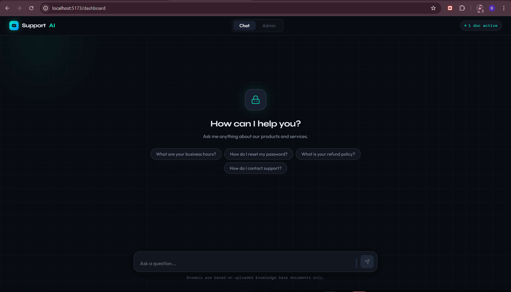
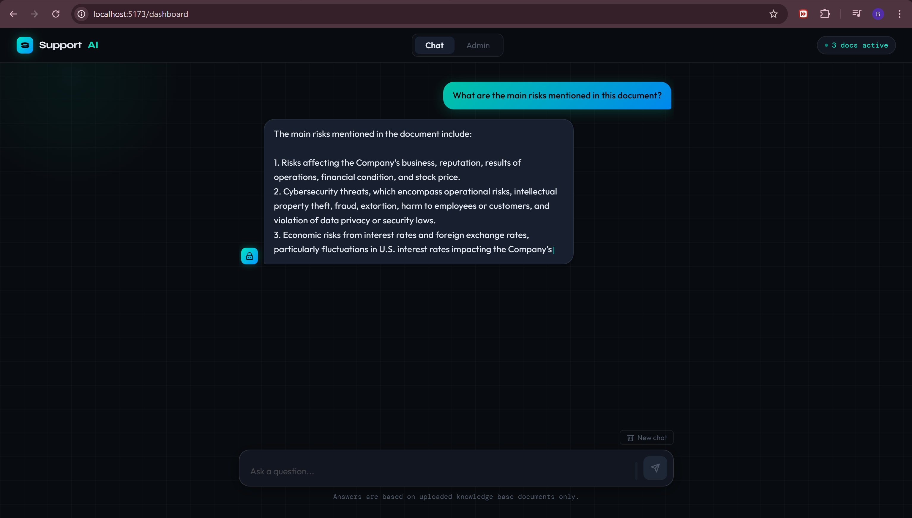
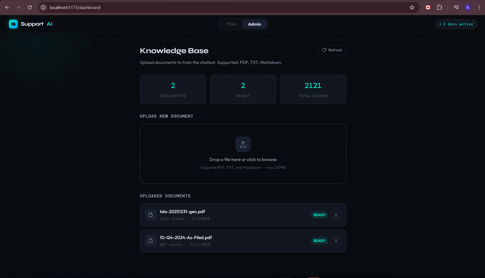
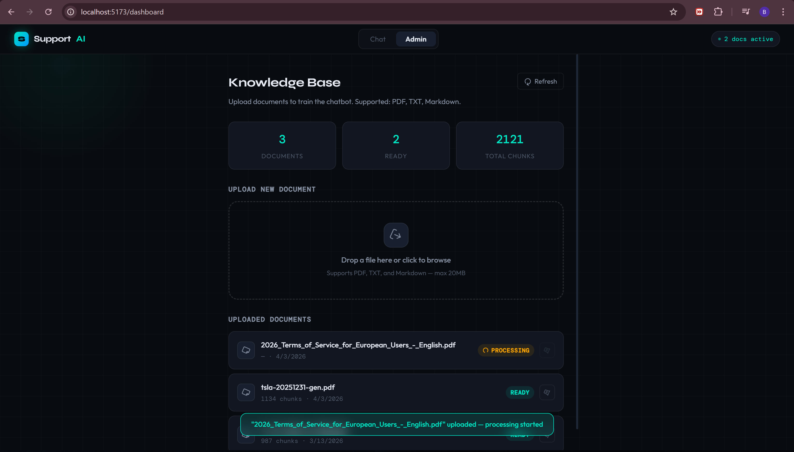
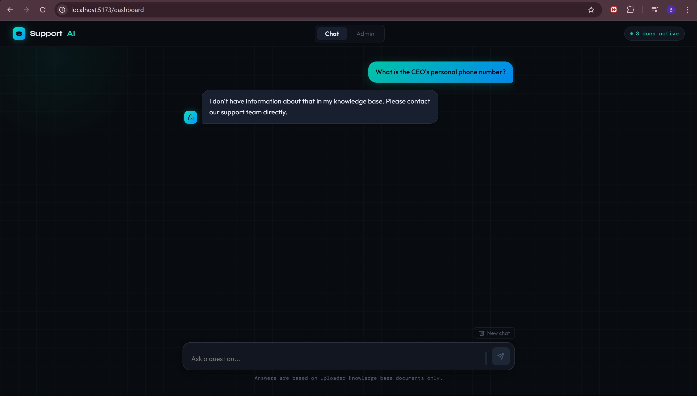

# SupportAI — AI Customer Support Agent

**Give your business a support agent that never sleeps.**

SupportAI is a knowledge-based AI assistant that learns everything about your business from your own documents — and uses that knowledge to answer customer questions instantly, accurately, and 24/7. When a question is too specific or sensitive, it knows to refer the customer to a human agent instead of guessing.

Built with a production RAG (Retrieval Augmented Generation) architecture using FastAPI, React, ChromaDB, and OpenAI.

---


---

## The Problem It Solves

Most businesses spend significant time answering the same customer questions repeatedly — pricing, policies, hours, procedures, product details. A human support agent can only work so many hours, handle so many conversations, and remember so many details.

SupportAI fixes this. You upload your business documentation once. The system learns it. From that point forward, any customer question gets an instant, accurate answer pulled directly from your actual content — not from a generic AI that guesses or makes things up.

When a question falls outside the knowledge base or requires human judgment, the bot says so clearly and directs the customer to a real person. No hallucinations. No wrong answers presented as facts.

---

## Screenshots

### Chat Interface

*Real-time streaming responses grounded in uploaded business documents*

### Streaming Answer in Progress

*Answers arrive token by token — no waiting for the full response*

### Admin Dashboard

*Upload, monitor, and manage knowledge base documents*

### Document Processing

*Documents are chunked, embedded, and stored in the vector database automatically*

### Graceful Fallback

*When the answer is not in the knowledge base, the bot refers to a human agent*

---

## Demo

> 🎬 Demo video coming soon.

> 🌐 Live deployment coming soon. Follow the setup guide below to run locally in under 10 minutes.

---

## How It Works

```
┌─────────────────────────────────────────────────────────────┐
│                    React Frontend (Vite)                     │
│           Chat Interface  │  Admin Dashboard                 │
└───────────────┬───────────────────────┬──────────────────────┘
                │ REST / SSE            │ REST
┌───────────────▼───────────────────────▼──────────────────────┐
│                      FastAPI Backend                          │
│                                                               │
│  ┌──────────────────────┐    ┌──────────────────────────────┐ │
│  │  Ingestion Pipeline  │    │      RAG Query Pipeline      │ │
│  │  PDF/TXT             │    │  1. Embed the question       │ │
│  │    → Extract text    │    │  2. Search ChromaDB          │ │
│  │    → Split chunks    │    │  3. Retrieve top 5 chunks    │ │
│  │    → Embed vectors   │    │  4. Build grounded prompt    │ │
│  │    → Store ChromaDB  │    │  5. Stream LLM answer        │ │
│  └──────────────────────┘    └──────────────────────────────┘ │
└───────────────┬───────────────────────┬──────────────────────┘
                │                       │
     ┌──────────▼──────────┐  ┌─────────▼──────────┐
     │     ChromaDB        │  │   SQLite Database   │
     │  (Vector Storage)   │  │  (Docs + History)   │
     └─────────────────────┘  └────────────────────┘
                                         │
                              ┌──────────▼──────────┐
                              │     OpenAI API       │
                              │  Embeddings + Chat   │
                              └─────────────────────┘
```

### The RAG Pipeline Explained

**At upload time:**
Your document is parsed, split into 500-character overlapping chunks, and each chunk is converted into a 1536-dimension vector using OpenAI's embedding model. These vectors are stored in ChromaDB alongside the original text.

**At query time:**
The user's question is converted into a vector. ChromaDB finds the 5 most semantically similar chunks using cosine similarity. Those chunks are injected into a system prompt along with the conversation history. GPT-4o-mini generates a grounded answer and streams it back token by token.

**The result:**
The AI can only answer from what you gave it. It cannot guess, hallucinate, or go off-topic.

---

## Features

- **Knowledge-Based Answers** — Every response is grounded in your uploaded documents. The AI cannot make up information.
- **24/7 Availability** — Once deployed, the assistant runs continuously with no human involvement needed for routine questions.
- **Smart Escalation** — When a question is outside the knowledge base, the bot clearly directs the customer to a human agent.
- **Streaming Responses** — Answers arrive word by word in real time — no waiting for the full response.
- **Multi-Turn Conversations** — The bot remembers the full conversation history within a session.
- **Document Management** — Upload, monitor, and delete documents through a clean admin dashboard.
- **Background Processing** — Documents are processed asynchronously so the interface never freezes.
- **Auto-Generated API Docs** — Full interactive API documentation at `/docs` powered by FastAPI.

---

## Tech Stack

| Layer | Technology | Why |
|-------|-----------|-----|
| Backend | FastAPI | Fast, async, auto-generates API docs |
| Language Model | OpenAI GPT-4o-mini | Cost-efficient and accurate |
| Embeddings | text-embedding-3-small | Best price/performance ratio |
| Vector Database | ChromaDB | Persistent, simple, no server needed |
| Relational Database | SQLite + SQLAlchemy | Zero setup, perfect for this scale |
| Document Parsing | PyPDF + LangChain Splitters | Reliable chunking with overlap |
| Frontend | React 18 + Vite | Fast dev experience, modern stack |
| HTTP | Axios + Fetch SSE | Regular requests + streaming |

---

## Project Structure

```
chatbot-portfolio/
├── backend/
│   ├── main.py                  # FastAPI app, middleware, startup
│   ├── config.py                # All settings via pydantic-settings
│   ├── database.py              # SQLAlchemy engine + session
│   ├── models.py                # Document + Conversation DB models
│   ├── api/
│   │   ├── admin.py             # Upload, list, delete, status endpoints
│   │   └── chat.py              # Message + history + clear endpoints
│   ├── services/
│   │   ├── ingestion.py         # Extract → chunk → embed → store pipeline
│   │   ├── retrieval.py         # Embed query → similarity search
│   │   └── llm.py               # Prompt building + streaming generation
│   ├── core/
│   │   ├── chunker.py           # RecursiveCharacterTextSplitter wrapper
│   │   └── embedder.py          # OpenAI embeddings via requests
│   └── data/
│       ├── uploads/             # Raw uploaded files (gitignored)
│       └── chroma_db/           # ChromaDB persistent store (gitignored)
└── frontend/
    └── src/
        ├── App.jsx              # Root component, layout, notifications
        ├── index.css            # Design tokens, animations, global styles
        ├── api/client.js        # All backend communication
        ├── hooks/
        │   ├── useChat.js       # Chat state, streaming, session management
        │   └── useDocuments.js  # Document CRUD + status polling
        └── components/
            ├── Chat/
            │   ├── ChatWindow.jsx       # Input, messages, suggestions
            │   ├── MessageBubble.jsx    # User and assistant bubbles
            │   └── TypingIndicator.jsx  # Animated dots while streaming
            └── Admin/
                ├── AdminPanel.jsx    # Dashboard layout and stats
                ├── DocumentList.jsx  # Document rows with status badges
                └── UploadZone.jsx    # Drag-and-drop upload area
```

---

## Getting Started

### Prerequisites

- Python 3.10+
- Node.js 18+
- An OpenAI API key — [platform.openai.com](https://platform.openai.com)

### 1. Clone the Repository

```bash
git clone https://github.com/BadrDyane/chatbot-portfolio.git
cd chatbot-portfolio
```

### 2. Backend Setup

```bash
cd backend

# Create virtual environment
python -m venv venv

# Activate — Mac/Linux:
source venv/bin/activate
# Activate — Windows:
venv\Scripts\activate

# Install dependencies
pip install -r requirements.txt
```

Create `backend/.env`:

```env
OPENAI_API_KEY=sk-your-key-here
OPENAI_MODEL=gpt-4o-mini
OPENAI_EMBEDDING_MODEL=text-embedding-3-small
CHROMA_PERSIST_DIR=./data/chroma_db
UPLOAD_DIR=./data/uploads
CHUNK_SIZE=500
CHUNK_OVERLAP=50
RETRIEVAL_TOP_K=5
MAX_FILE_SIZE_MB=20
```

Start the backend:

```bash
uvicorn main:app --reload --port 8000
```

Interactive API docs available at `http://localhost:8000/docs`

### 3. Frontend Setup

```bash
cd ../frontend
npm install
npm run dev
```

### 4. Open the App

```
http://localhost:5173
```

---

## Usage Guide

### Step 1 — Add your business documents

Go to the **Admin** tab. Upload any PDF or TXT file containing your business information — FAQs, product manuals, policy documents, pricing guides, anything relevant.

Wait for the status badge to turn **Ready**. The document is now part of the knowledge base.

### Step 2 — Start answering questions

Switch to the **Chat** tab. Ask any question related to your uploaded content. The assistant retrieves the most relevant sections and generates an accurate, grounded response.

### Step 3 — Watch the escalation work

Ask something outside the knowledge base — a highly personal question, an edge case, something not in any document. The assistant will acknowledge it cannot answer and direct the user to a human agent.

### What makes a good question

```
✅ "What is your return policy?"
✅ "How do I reset my password?"
✅ "What are your business hours?"
✅ "What does the premium plan include?"
✅ "How do I contact support?"

❌ "What is the company name?"  — too vague, no strong chunk match
❌ "Tell me everything"          — too broad
```

---

## API Reference

### Admin

| Method | Endpoint | Description |
|--------|----------|-------------|
| `POST` | `/admin/documents/upload` | Upload a document |
| `GET` | `/admin/documents` | List all documents |
| `GET` | `/admin/documents/{id}/status` | Poll processing status |
| `DELETE` | `/admin/documents/{id}` | Delete a document |

### Chat

| Method | Endpoint | Description |
|--------|----------|-------------|
| `POST` | `/chat/message` | Send message, receive SSE stream |
| `GET` | `/chat/history/{session_id}` | Load conversation history |
| `DELETE` | `/chat/history/{session_id}` | Clear a conversation |

### System

| Method | Endpoint | Description |
|--------|----------|-------------|
| `GET` | `/health` | Server health check |

---

## Engineering Notes

**Why `requests` instead of the OpenAI SDK?**
The OpenAI Python SDK uses `httpx` internally which conflicts with certain Windows Server SSL and proxy configurations. Rather than fighting the dependency, the OpenAI REST API is called directly using `requests` — identical functionality, zero compatibility issues. This is a real problem-solving decision encountered and resolved during development.

**Why background tasks for ingestion?**
Large PDFs can take 10–30 seconds to process. Synchronous ingestion would time out the HTTP request. FastAPI's `BackgroundTasks` returns `202 Accepted` immediately, processes the document asynchronously, and updates the database record when complete. The frontend polls the status endpoint every 2 seconds until the document is ready.

**Why `temperature=0.3`?**
A support bot must be precise and consistent. Lower temperature reduces creative variation and keeps answers factual. A customer asking about a refund policy needs the correct answer — not a creative interpretation of it.

**Why overlapping chunks?**
A 50-character overlap between adjacent chunks prevents important context from being cut at a boundary and lost during retrieval. If a key sentence spans two chunks, the overlap ensures neither chunk loses critical meaning.

---

## Roadmap

- [ ] Website URL as a knowledge source (web scraping ingestion)
- [ ] Multi-tenant support — separate knowledge bases per client
- [ ] Admin authentication and access control
- [ ] DOCX and CSV file support
- [ ] Re-ranking retrieved chunks for improved accuracy
- [ ] Usage analytics — questions asked, escalation rate, top topics
- [ ] Docker Compose for one-command deployment
- [ ] Live cloud deployment

---

## Use Cases

SupportAI can be deployed for any business that handles repetitive customer questions:

| Industry | Example Use |
|----------|------------|
| E-commerce | Product info, shipping times, return policies |
| SaaS | Feature questions, onboarding, troubleshooting |
| Healthcare | Appointment policies, service info, FAQs |
| Real Estate | Listing questions, process explanations |
| Education | Enrollment, deadlines, campus policies |
| Finance | Service info, account FAQs, process guides |
| Any business | Anything currently answered by a human support agent |

---

## Author

**Badr Dyane**
Full-Stack Developer — AI & Automation Specialist

- GitHub: [github.com/BadrDyane](https://github.com/BadrDyane)
- Email: [badrdyane@gmail.com](mailto:badrdyane@gmail.com)

Looking for a custom AI assistant built around your business? Get in touch.

---

## License

This project is open source under the [MIT License](LICENSE).
